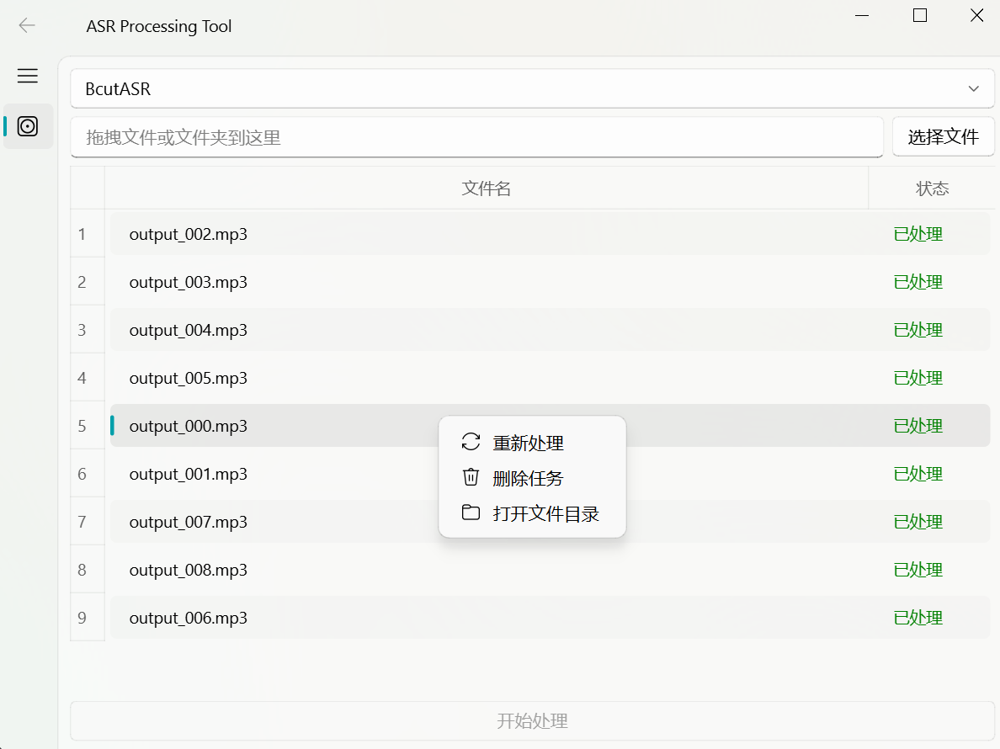

# 🎤 AsrTools

🎙️✨ **AsrTools**：智能语音转字幕文本工具

 对比 Github 目前多数的音频转换文字项目（通过调用 Wishper 等模型），本项目最大区别和优势就是无需 GPU 和繁琐的本地配置。

欢迎为项目给上一个 Star。


## 🌟 **特色功能**

- 🚀 **无需复杂配置**：无需 GPU 和繁琐的本地配置，小白也能轻松使用。
- 🖥️ **高颜值界面**：基于 **PyQt5** 和 **qfluentwidgets**，界面美观且用户友好。
- ⚡ **效率超人**：多线程并发 + 批量处理，文字转换快如闪电。
- 📄 **多格式支持**：支持生成 `.srt` 和 `.txt` 字幕文件，满足不同需求。


## 🌟 未来计划（TODO）

- 🎥 视频直接处理：支持输入视频文件自动转换为音频文件，无需用户手动转换为mp3等音频格式。
- 📄 多样化输出：增加输出格式选择，提供更多字幕格式选项，满足不同用户需求。
- 🔀 一键字幕视频：增加视频自动加字幕功能，一键完成从视频到带字幕视频的全流程。
- 🔗 API 集成：提供 API 接口，允许开发者将 AsrTools 集成到自己的工作流程中。
- ✏️ 字幕编辑器：集成一个简单的字幕编辑界面，允许用户直接修改、调整时间轴和校正识别错误。


*主界面截图示例*




### 🖥️ **快速上手**

1. **启动应用**：运行下载的可执行文件或通过命令行启动 GUI 界面。
2. **选择 ASR 引擎**：在下拉菜单中选择你需要使用的 ASR 引擎。
3. **添加文件**：点击“选择文件”按钮或将文件/文件夹拖拽到指定区域。
4. **开始处理**：点击“开始处理”按钮，程序将自动开始转换，并在完成后在原音频目录生成 `.srt` 或 `.txt` 字幕文件。（默认保持 3 个线程运行）

## 🛠️ **安装指南**

###  **1. 从发布版本安装**

我为 Windows 用户提供了打包好的[Release](https://github.com/WEIFENG2333/AsrTools/releases)版本，下载后解压即可直接使用，无需配置环境。

或者从网盘下载：[https://wwwm.lanzoue.com/i3YaY2clcp7a](https://wwwm.lanzoue.com/i3YaY2clcp7a)

运行解压后的 `AsrTools.exe`，即可启动 GUI 界面。


###  **2. 从源码安装（开发者）**

项目的依赖仅仅为 `requests`。

如果您需要 GUI 界面，请额外安装 `PyQt5`, `qfluentwidgets`。

如果您想从源码运行，请按照以下步骤操作：

1. **克隆仓库并进入项目目录**

    ```bash
    git clone https://github.com/WEIFENG2333/AsrTools.git
    cd AsrTools
    ```

2. **安装依赖并运行**

    - **启动 GUI 界面**

        ```bash
        pip install -r requirements.txt
        python asr_gui.py
        ```

    - **纯代码调用示例**

        ```bash
        pip install requests
        python example.py
        ```


---

## 📬 **联系与支持**

- **Issues**：[提交问题](https://github.com/WEIFENG2333/AsrTools/issues)

感谢您使用 **AsrTools**！🎉  

目前项目的相关调用和GUI页面的功能仍在不断完善中...

希望这款工具能为您带来便利。😊

---
## Star History

[](https://star-history.com/#WEIFENG2333/AsrTools&Date)


---
## Star History

[](https://star-history.com/#WEIFENG2333/AsrTools&Date)